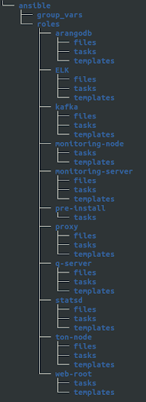
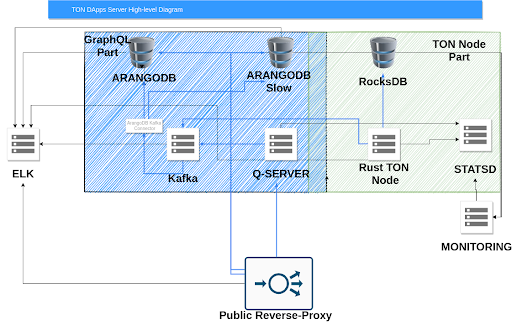
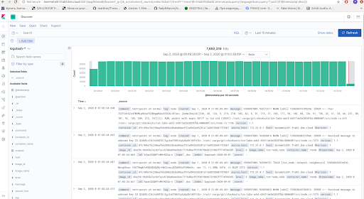
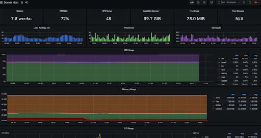
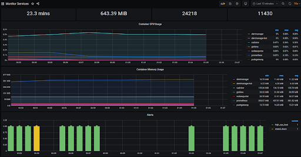
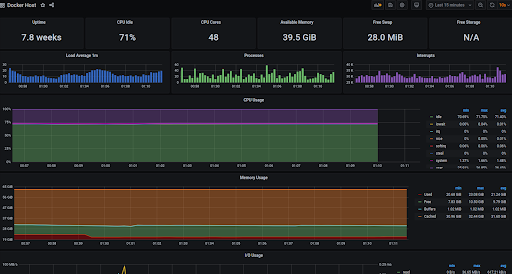
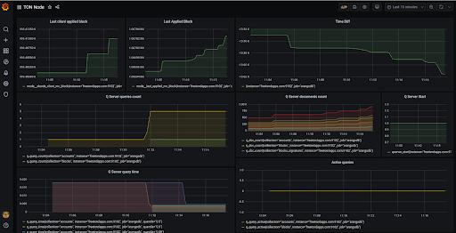
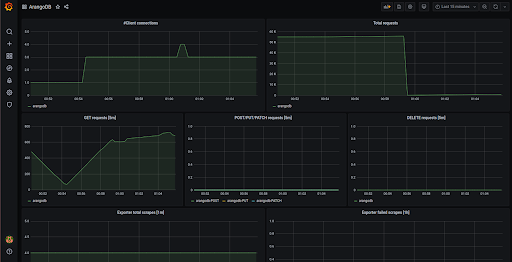
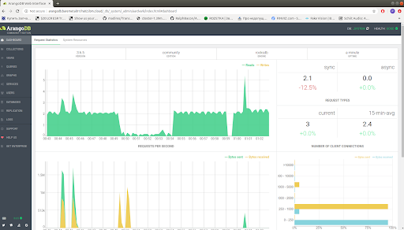
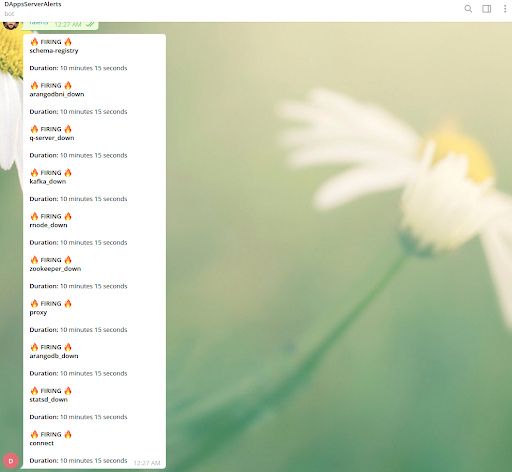

## Description

Repository contains all the build and config files required for setting up TON-OS-DApp-Server using a fully automated approach based on Ansible.


## Technology stack


*   **Ansible** - tool which automates all configuration
*   **Docker** - builds images and hosts TON-OS-DApp-Server containers
*   **Docker-compose** - describes TON-OS-DApp-Server 
*   **ELK** - collects logs from all the Docker containers
*   **Prometheus** - scrapes metrics from TON-OS-DApp-Server components
*   **Alertmanager** - responsible for alerts and notifications


## System requirements


<table>
  <tr>
   <td><strong>Configuration</strong>
   </td>
   <td><strong>CPU (cores)</strong>
   </td>
   <td><strong>RAM (GiB)</strong>
   </td>
   <td><strong>Storage (GiB)</strong>
   </td>
   <td><strong>Network (Gbit/s)</strong>
   </td>
  </tr>
  <tr>
   <td>Recommended
   </td>
   <td>24
   </td>
   <td>192
   </td>
   <td>2000
   </td>
   <td>1
   </td>
  </tr>
</table>


**NOTE**: SSD disks are recommended for the storage.


## Prerequisites


1. At least 1 server with public IP address (at least- responsible for alerts and notifications 3 recommended)
2. Public DNS A entries for DApp server: 
*   Graphql A record
*   ArangoDB A record
*   ArangoDBNI A record
3. Ansible installed. Required version - 2.9.6

If you don't have a public DNS zone you can buy from any provider. e.q. GoDaddy. If you don't familiar with that just follow this page [https://ua.godaddy.com/domains](https://ua.godaddy.com/domains) 

As an additional layer of security you can add domain to [Cloudflare](cloudflare.com) (or use [letsencrypt](https://letsencrypt.org), playbook by default will issue certificates in letsencrypt automatically)

By default playbook will install 2 endpoints with basic auth (see group_vars/proxy):

```
  <inventory_hostname>
  arangodb.<inventory_hostname>
  arangodbni.<inventory_hostname>
```

If you want to customize this hostnames specify ARANGODB_VIRTUAL_HOST and ARANGODBNI_VIRTUAL_HOST variables inside group_vars/arangodb

**NOTE**: In case of setup **single-node architecture** you can point A records to single IP


## Quick start


1. Navigate to ansible directory:
```
cd ansible
```
2. Specify where to install DApp server components in hosts file:
```
vim hosts
```
3. Copy ssh pub key to remote server (optional, because password also can be used)

4. Install docker, docker-compose, and setup docker network:
```
ansible-playbook -u root -i hosts run.yml -t install
```
5. Run DApp server node:
```
ansible-playbook -u root -i hosts run.yml -t up
```
6. Stop DApp server node:
```
ansible-playbook -u root -i hosts run.yml -t down
```

**NOTE**: please note that only hostnames should be used! Alternatively you can use ansible_connection=local


## Project structure

Project is based on Ansible and follows all the best practices for writing playbooks. 


<table>
  <tr>
   <td><strong>Ansible project structure</strong>
   </td>
   <td><strong>Description</strong>
   </td>
  </tr>
  <tr>
   <td>
<p>
============================


   </td>
   <td>    
<p>
    Ansible project includes all the required roles to spin up monitoring, logging, alerting and DApp server nodes itself.  
<p>
    Each component has its own role. Components of DApp server node are the following:

<li>Arangodb

<li>Kafka

<li>Proxy

<li>Q-server

<li>Statsd

<li>Ton-node

<li>Web.root

<p>
Monitoring, logging and alerting stack:

<li>ELK

<li>Monitoring-node

<li>Monitoring-server

<p>
And pre_install role to manage docker setup.
<p>
    Each role has variables defined in group_vars/<ansible_role_name></em> which are used to parse “Tasks” and “Templates”.
<p>
Each role also has several directories:


<li><em>Files</em> (build files and static configs)

<li><em>Tasks</em> (list of commands to run)

<li><em>Templates</em> (docker-compose.yml and some additional configs to parse)

<p>
    The main file is called <em>run.yml</em> and it works in conjunction with the hosts file to manage where to execute specific roles. 
</li>
</li>
</li>
   </td>
  </tr>
</table>


### Variables description


<table>
  <tr>
   <td><strong>Parameter</strong>
   </td>
   <td><strong>Description</strong>
   </td>
   <td><strong>Default</strong>
   </td>
  </tr>
  <tr>
   <td>ARANGO_NO_AUTH
   </td>
   <td>Disabling arangodb authentication. Need to set to 0 for production
   </td>
   <td>1
   </td>
  </tr>
  <tr>
   <td>VIRTUAL_HOST
   </td>
   <td>External hostname to access arangodb UI
   </td>
   <td>arango.baremetal01.fra02.ibm.cloud
   </td>
  </tr>
  <tr>
   <td>VIRTUAL_PORT
   </td>
   <td>
   </td>
   <td>8529
   </td>
  </tr>
  <tr>
   <td>LETSENCRYPT_HOST
   </td>
   <td>Hostname on which SSL should be issued
   </td>
   <td>arango.baremetal01.fra02.ibm.cloud
   </td>
  </tr>
  <tr>
   <td>LETSENCRYPT_EMAIL
   </td>
   <td>
   </td>
   <td>senegalelastico@gmail.com
   </td>
  </tr>
  <tr>
   <td>ARANGODB_OVERRIDE_DETECTED_TOTAL_MEMORY
   </td>
   <td>
   </td>
   <td>343579738368
   </td>
  </tr>
  <tr>
   <td>ARANGO_ROOT_PASSWORD
   </td>
   <td>
   </td>
   <td>
   </td>
  </tr>
  <tr>
   <td>NETWORK_TYPE
   </td>
   <td>TON Network
   </td>
   <td>net.ton.dev
   </td>
  </tr>
  <tr>
   <td>INSTANCE_NAME
   </td>
   <td>
   </td>
   <td>first
   </td>
  </tr>
  <tr>
   <td>ARANGO_SERVICE_SERVICE_HOST
   </td>
   <td>
   </td>
   <td>arangodb
   </td>
  </tr>
  <tr>
   <td>ARANGO_SERVICE_SERVICE_PORT
   </td>
   <td>
   </td>
   <td>8529
   </td>
  </tr>
  <tr>
   <td>ARANGONI_SERVICE_SERVICE_HOST
   </td>
   <td>
   </td>
   <td>arangodbni
   </td>
  </tr>
  <tr>
   <td>ARANGONI_SERVICE_SERVICE_PORT
   </td>
   <td>
   </td>
   <td>8529
   </td>
  </tr>
  <tr>
   <td>ARANGONI_NO_AUTH
   </td>
   <td>Disabling arangodb authentication. Need to set to 0 for production
   </td>
   <td>1
   </td>
  </tr>
  <tr>
   <td>ARANGONI_VIRTUAL_HOST
   </td>
   <td>External hostname to access arangodb webui
   </td>
   <td>arangoni.baremetal01.fra02.ibm.cloud
   </td>
  </tr>
  <tr>
   <td>ARANGONI_VIRTUAL_PORT
   </td>
   <td>Internal ports
   </td>
   <td>8529
   </td>
  </tr>
  <tr>
   <td>ARANGONI_LETSENCRYPT_HOST
   </td>
   <td>External hostname to access arangodb webui
   </td>
   <td>arangoni.baremetal01.fra02.ibm.cloud
   </td>
  </tr>
  <tr>
   <td>ARANGONI_LETSENCRYPT_EMAIL
   </td>
   <td>
   </td>
   <td>senegalelastico@gmail.com
   </td>
  </tr>
  <tr>
   <td>discovery_type
   </td>
   <td>ELK
   </td>
   <td>single-node
   </td>
  </tr>
  <tr>
   <td>ZOOKEEPER_CLIENT_PORT
   </td>
   <td>
   </td>
   <td>2181
   </td>
  </tr>
  <tr>
   <td>ZOOKEEPER_TICK_TIME
   </td>
   <td>
   </td>
   <td>2000
   </td>
  </tr>
  <tr>
   <td>KAFKA_BROKER_ID
   </td>
   <td>
   </td>
   <td>1
   </td>
  </tr>
  <tr>
   <td>KAFKA_ZOOKEEPER_CONNECT
   </td>
   <td>URL to zookeeper
   </td>
   <td>zookeeper:2181
   </td>
  </tr>
  <tr>
   <td>KAFKA_ADVERTISED_LISTENERS
   </td>
   <td>
   </td>
   <td>PLAINTEXT://kafka:29092,PLAINTEXT_HOST://kafka:9092
   </td>
  </tr>
  <tr>
   <td>KAFKA_LISTENER_SECURITY_PROTOCOL_MAP
   </td>
   <td>
   </td>
   <td>PLAINTEXT:PLAINTEXT,PLAINTEXT_HOST:PLAINTEXT
   </td>
  </tr>
  <tr>
   <td>KAFKA_INTER_BROKER_LISTENER_NAME
   </td>
   <td>
   </td>
   <td>PLAINTEXT
   </td>
  </tr>
  <tr>
   <td>KAFKA_OFFSETS_TOPIC_REPLICATION_FACTOR
   </td>
   <td>
   </td>
   <td>1
   </td>
  </tr>
  <tr>
   <td>KAFKA_JMX_PORT
   </td>
   <td>
   </td>
   <td>9581
   </td>
  </tr>
  <tr>
   <td>KAFKA_LOG_RETENTION_HOURS
   </td>
   <td>
   </td>
   <td>4
   </td>
  </tr>
  <tr>
   <td>KAFKA_LOG_ROLL_MS
   </td>
   <td>
   </td>
   <td>600000
   </td>
  </tr>
  <tr>
   <td>KAFKA_LOG_SEGMENT_BYTES
   </td>
   <td>
   </td>
   <td>1073741824
   </td>
  </tr>
  <tr>
   <td>KAFKA_LOG_RETENTION_CHECK_INTERVAL_MS
   </td>
   <td>
   </td>
   <td>300000
   </td>
  </tr>
  <tr>
   <td>KAFKA_CLEANUP_POLICY
   </td>
   <td>
   </td>
   <td>delete
   </td>
  </tr>
  <tr>
   <td>KAFKA_RETENTION_MS
   </td>
   <td>
   </td>
   <td>43200000
   </td>
  </tr>
  <tr>
   <td>KAFKA_MESSAGE_MAX_BYTES
   </td>
   <td>
   </td>
   <td>3001000
   </td>
  </tr>
  <tr>
   <td>KAFKA_RECEIVE_MESSAGE_MAX_BYTES
   </td>
   <td>
   </td>
   <td>3001000
   </td>
  </tr>
  <tr>
   <td>KAFKA_REPLICA_FETCH_MAX_BYTES
   </td>
   <td>
   </td>
   <td>3001000
   </td>
  </tr>
  <tr>
   <td>CONNECT_BOOTSTRAP_SERVERS
   </td>
   <td>
   </td>
   <td>kafka:29092
   </td>
  </tr>
  <tr>
   <td>CONNECT_REST_ADVERTISED_HOST_NAME
   </td>
   <td>
   </td>
   <td>connect
   </td>
  </tr>
  <tr>
   <td>CONNECT_REST_PORT
   </td>
   <td>
   </td>
   <td>8083
   </td>
  </tr>
  <tr>
   <td>CONNECT_GROUP_ID
   </td>
   <td>
   </td>
   <td>compose-connect-group
   </td>
  </tr>
  <tr>
   <td>CONNECT_CONFIG_STORAGE_TOPIC
   </td>
   <td>
   </td>
   <td>docker-connect-configs
   </td>
  </tr>
  <tr>
   <td>CONNECT_CONFIG_STORAGE_REPLICATION_FACTOR
   </td>
   <td>
   </td>
   <td>1
   </td>
  </tr>
  <tr>
   <td>CONNECT_OFFSET_FLUSH_INTERVAL_MS
   </td>
   <td>
   </td>
   <td>10000
   </td>
  </tr>
  <tr>
   <td>CONNECT_OFFSET_STORAGE_TOPIC
   </td>
   <td>
   </td>
   <td>docker-connect-offsets
   </td>
  </tr>
  <tr>
   <td>CONNECT_OFFSET_STORAGE_REPLICATION_FACTOR
   </td>
   <td>
   </td>
   <td>1
   </td>
  </tr>
  <tr>
   <td>CONNECT_STATUS_STORAGE_TOPIC
   </td>
   <td>
   </td>
   <td>docker-connect-status
   </td>
  </tr>
  <tr>
   <td>CONNECT_STATUS_STORAGE_REPLICATION_FACTOR
   </td>
   <td>
   </td>
   <td>1
   </td>
  </tr>
  <tr>
   <td>CONNECT_KEY_CONVERTER
   </td>
   <td>
   </td>
   <td>org.apache.kafka.connect.storage.StringConverter
   </td>
  </tr>
  <tr>
   <td>CONNECT_VALUE_CONVERTER
   </td>
   <td>
   </td>
   <td>io.confluent.connect.avro.AvroConverter
   </td>
  </tr>
  <tr>
   <td>CONNECT_VALUE_CONVERTER_SCHEMA_REGISTRY_URL
   </td>
   <td>
   </td>
   <td>http://schema-registry:8081
   </td>
  </tr>
  <tr>
   <td>CONNECT_INTERNAL_KEY_CONVERTER
   </td>
   <td>
   </td>
   <td>org.apache.kafka.connect.json.JsonConverter
   </td>
  </tr>
  <tr>
   <td>CONNECT_INTERNAL_VALUE_CONVERTER
   </td>
   <td>
   </td>
   <td>org.apache.kafka.connect.json.JsonConverter
   </td>
  </tr>
  <tr>
   <td>CONNECT_ZOOKEEPER_CONNECT
   </td>
   <td>
   </td>
   <td>zookeeper:2181
   </td>
  </tr>
  <tr>
   <td>CLASSPATH
   </td>
   <td>
   </td>
   <td>/usr/share/java/monitoring-interceptors/monitoring-interceptors-5.2.1.jar
   </td>
  </tr>
  <tr>
   <td>CONNECT_PRODUCER_INTERCEPTOR_CLASSES
   </td>
   <td>
   </td>
   <td>io.confluent.monitoring.clients.interceptor.MonitoringProducerInterceptor
   </td>
  </tr>
  <tr>
   <td>CONNECT_CONSUMER_INTERCEPTOR_CLASSES
   </td>
   <td>
   </td>
   <td>io.confluent.monitoring.clients.interceptor.MonitoringConsumerInterceptor
   </td>
  </tr>
  <tr>
   <td>CONNECT_PLUGIN_PATH
   </td>
   <td>
   </td>
   <td>/usr/share/java,/usr/share/confluent-hub-components
   </td>
  </tr>
  <tr>
   <td>CONNECT_LOG4J_LOGGERS
   </td>
   <td>
   </td>
   <td>org.apache.zookeeper=ERROR,org.I0Itec.zkclient=ERROR,org.reflections=ERROR
   </td>
  </tr>
  <tr>
   <td>CONNECT_KAFKA_JMX_PORT
   </td>
   <td>
   </td>
   <td>9584
   </td>
  </tr>
  <tr>
   <td>CONNECT_FETCH_MESSAGE_MAX_BYTES
   </td>
   <td>Important limit! Without it ton-node can’t work
   </td>
   <td>4000000
   </td>
  </tr>
  <tr>
   <td>CONNECT_MAX_REQUEST_SIZE
   </td>
   <td>Important limit! Without it ton-node can’t work
   </td>
   <td>4000000
   </td>
  </tr>
  <tr>
   <td>CONNECT_MAX_PARTITION_FETCH_BYTES
   </td>
   <td>Important limit! Without it ton-node can’t work
   </td>
   <td>4000000
   </td>
  </tr>
  <tr>
   <td>SCHEMA_REGISTRY_HOST_NAME
   </td>
   <td>
   </td>
   <td>schema-registry
   </td>
  </tr>
  <tr>
   <td>SCHEMA_REGISTRY_KAFKASTORE_CONNECTION_URL
   </td>
   <td>
   </td>
   <td>zookeeper:2181
   </td>
  </tr>
  <tr>
   <td>SCHEMA_REGISTRY_JMX_PORT
   </td>
   <td>
   </td>
   <td>9582
   </td>
  </tr>
  <tr>
   <td>ADVERTISED_LISTENER
   </td>
   <td>
   </td>
   <td>
   </td>
  </tr>
  <tr>
   <td>telegram_user_ids
   </td>
   <td>List of TG IDs \
Check @getmyid_bot
   </td>
   <td>
   </td>
  </tr>
  <tr>
   <td>telegram_bot_token
   </td>
   <td>TG Bot token \
Check @BotFather
   </td>
   <td>
   </td>
  </tr>
  <tr>
   <td>grafana_username
   </td>
   <td>Grafana UI user
   </td>
   <td>
   </td>
  </tr>
  <tr>
   <td>grafana_password
   </td>
   <td>Grafana UI password
   </td>
   <td>
   </td>
  </tr>
  <tr>
   <td>auth
   </td>
   <td>Boolean \
If true basic auth will be configured for each endpoint
   </td>
   <td>
   </td>
  </tr>
  <tr>
   <td>username
   </td>
   <td>Proxy auth user
   </td>
   <td>
   </td>
  </tr>
  <tr>
   <td>password
   </td>
   <td>Proxy auth password
   </td>
   <td>
   </td>
  </tr>
  <tr>
   <td>version
   </td>
   <td>Q-server git branch to build
   </td>
   <td>master
   </td>
  </tr>
  <tr>
   <td>VIRTUAL_HOST
   </td>
   <td>
   </td>
   <td>q-server
   </td>
  </tr>
  <tr>
   <td>VIRTUAL_PORT
   </td>
   <td>
   </td>
   <td>4000
   </td>
  </tr>
  <tr>
   <td>Q_DATABASE_SERVER
   </td>
   <td>
   </td>
   <td>arangodb:8529
   </td>
  </tr>
  <tr>
   <td>Q_SLOW_DATABASE_SERVER
   </td>
   <td>
   </td>
   <td>arangodbni:8529
   </td>
  </tr>
  <tr>
   <td>Q_REQUESTS_MODE
   </td>
   <td>
   </td>
   <td>kafka
   </td>
  </tr>
  <tr>
   <td>Q_REQUESTS_SERVER
   </td>
   <td>
   </td>
   <td>kafka:9092
   </td>
  </tr>
  <tr>
   <td>Q_REQUESTS_TOPIC
   </td>
   <td>
   </td>
   <td>requests
   </td>
  </tr>
  <tr>
   <td>Q_DATABASE_MAX_SOCKETS
   </td>
   <td>
   </td>
   <td>100
   </td>
  </tr>
  <tr>
   <td>Q_SLOW_DATABASE_MAX_SOCKETS
   </td>
   <td>
   </td>
   <td>20
   </td>
  </tr>
  <tr>
   <td>IMAGE
   </td>
   <td>Statsd docker image repo
   </td>
   <td>prom/statsd-exporter:v0.12.2
   </td>
  </tr>
  <tr>
   <td>ARGS
   </td>
   <td>
   </td>
   <td>--statsd.mapping-config=/statsd-mappings/statsd-mapping.yaml
   </td>
  </tr>
  <tr>
   <td>UDP_PORT
   </td>
   <td>
   </td>
   <td>9125
   </td>
  </tr>
  <tr>
   <td>TCP_PORT
   </td>
   <td>
   </td>
   <td>9102
   </td>
  </tr>
  <tr>
   <td>IntIP
   </td>
   <td>
   </td>
   <td>30303
   </td>
  </tr>
  <tr>
   <td>version
   </td>
   <td>DApp node git branch
   </td>
   <td>master
   </td>
  </tr>
  <tr>
   <td>ADNL_PORT
   </td>
   <td>
   </td>
   <td>30303
   </td>
  </tr>
  <tr>
   <td>VALIDATOR_NAME
   </td>
   <td>
   </td>
   <td>my_validator
   </td>
  </tr>
  <tr>
   <td>NETWORK_TYPE
   </td>
   <td>
   </td>
   <td>net.ton.dev
   </td>
  </tr>
  <tr>
   <td>CONFIGS_PATH
   </td>
   <td>
   </td>
   <td>/ton-node/configs
   </td>
  </tr>
  <tr>
   <td>STATSD_DOMAIN
   </td>
   <td>
   </td>
   <td>statsd:
   </td>
  </tr>
  <tr>
   <td>STATSD_PORT
   </td>
   <td>
   </td>
   <td>9125
   </td>
  </tr>
  <tr>
   <td>MEM_LIMIT
   </td>
   <td>
   </td>
   <td>32G
   </td>
  </tr>
  <tr>
   <td>STAKE
   </td>
   <td>
   </td>
   <td>
   </td>
  </tr>
  <tr>
   <td>MSIG_ENABLE
   </td>
   <td>
   </td>
   <td>
   </td>
  </tr>
  <tr>
   <td>SDK_URL
   </td>
   <td>
   </td>
   <td>
   </td>
  </tr>
  <tr>
   <td>protocol
   </td>
   <td>Web.root protocol
   </td>
   <td>http
   </td>
  </tr>
</table>


## High-Level Architecture diagram


## 





**TON OS DApp Server** is a set of services enabling you to work with TON blockchain.

The core element of TON OS DApp Server is a TON node written in Rust focused on performance and safety. TON OS DApp Server provides a set of services serving TON SDK endpoint: scalable multi-model database ArangoDB with the information about all blockchain entities (like accounts, blocks, transactions, etc.) stored over time, distributed high-throughput, low-latency streaming platform Kafka, TON GraphQL Server (aka Q-Server) for serving GraphQL queries to the database and Nginx web-server.

**Q-Server** is accessible with GraphQL HTTP/WebSocket protocol on port "4000" and path "/graphql". Q-Server represents the read only part to provide GraphQL Endpoint. In case of write operation Q-Server creates an event into the Kafka and responds back. Then ton-node will catch this message and send it into blockchain.   

**Rust TON Node** works with Kafka and two arangodb databases and also depends on statsd. As a database TON Node uses RocksDB.

With help of our ansible-playbook TON DApps Server can be setup in several ways:

*   Single-node architecture

In this case all components will be installed on a single node (“all-in-one”). Including monitoring server and logging server.

*   Multi-node architecture

Automation scripts provide a way to install each component to different nodes. We recommend installing kafka, arangodb`s, q-server separately from tone node. To ensure that the ton-node will have maximum possible network throughput and IOPS.

**Kafka** used by q-server and ton-node. Also Kafka uses two Arangodb databases. For Kafka -> Arangodb communication kafka uses _arangodb kafka connector.


## Logging

Please, note that for production use it’s recommended to setup logging software without public access or additionally configure authentication.

Each docker container has logging configuration to send logs over UDP to remote (or local in case of single node architecture).  All processes inside docker containers configured to send logs to stdout/stderr. This way helps ensure that components (especially **ton-node**) will have a maximum of available server IOPS. Automation scripts use a Gelf logging driver.

Configuration example:
```
    logging:
      driver: gelf
      options:
        gelf-address: "udp://logstash:12201"
        tag: "statsd"
```

Logs go to the logstash docker container. In logstash we can configure additional logs parsing and processing. From logstash logs passes to elasticsearch. Kibana setup to provide a web interface for logs representation and search.

Logs from each container tagget get a unique tag to provide the ability to separate logs. There are several tags exists:

*   ton-node
*   q-server
*   arangodb
*   kafka
*   statsd, etc ...

Kibana: 





## Monitoring

**General prometheus dashboard**

Alerts, monitoring stack information



**Docker containers:**

CPU/Memory/Disk/Status



**Docker Host Dashboard**

Overall information about docker hosts. CPU/Memory/IOPS, etc



**Q-Server** configured to reports several StatsD metrics:
```
   Metric                Type     Tags             Description

    --------------------  -------  ---------------  -------------------------------------------------------------

    qserver.start         counter  collection=name  Incremented for each start.

                                                    Contains the `version` tag.

    qserver.doc.count     counter  collection=name  Incremented for each db event (document insert/update)

    qserver.post.count    counter                   Incremented for each node request

    qserver.post.failed   counter                   Incremented for each failed node request

    qserver.query.count   counter  collection=name  Incremented for each db query

    qserver.query.failed  counter  collection=name  Incremented for each failed db query

    qserver.query.slow    counter  collection=name  Incremented each time when q-server has encountered

                                                    slow query

    qserver.query.time    timer    collection=name  Reported each time when q-server has finished 

                                                    query handler from SDK client

                                                       

    qserver.query.active  gauge    collection=name  Updated each time when q-server has started and finished 

                                                    query handler from SDK client
```
**Rust TON Node** configured to reports this StatsD metrics: \
```
 Metric                Type     Tags             Description

    --------------------  -------  ---------------  -------------------------------------------------------------

rnode.shards_client_mc_block  gauge Reportes client shard block

node.last_applied_mc_block gauge  Reportes applied block in current block \
```
We have aggregated all information related to q-server and rust ton node to Grafana dashboard:



**ArangoDB** configured to provide this metrics to Prometheus:
```
 Metric                Type     Tags             Description

    --------------------  -------  ---------------  -------------------------------------------------------------

arangodb_process_statistics_system_time gauge collection=name  Amount of time that this process has been scheduled in user mode, measured in seconds.

arangodb_process_statistics_user_time 279.03

arangodb_server_statistics_physical_memory 3.43579738368e+11 gauge Number of seconds elapsed since server start.

arangodb_server_statistics_server_uptime gauge arangodb_client_user_connection_statistics_request_time_sum gauge

arangodb_client_user_connection_statistics_request_time_sum gauge arangodb_client_user_connection_statistics_total_time_bucket Total time needed to answer a request (only user traffic)

…
```
Metrics aggregated to Grafana Dashboard:



Also optionally arangodb web interface could be exposed:



## Alerts

We configured Telegram bot to send notification to Telegram. Bot added to prometheus docker-compose. Prometheus configured to send a web-hook to it. To create bot use @botfather the provide token into vars and start monitoring-server playbook \

Alerts example:





## GraphQL query examples

After DApss Server installed. We need to verify that DApss Server works properly. We need to check both types of queries **read** and **write**. 

Some examples how to do that described below:

Queries to **read** data from blockchain**:** 
```
{

  accounts(

    filter: {

      id: {

        eq: "0:5b168970a9c63dd5c42a6afbcf706ef652476bb8960a22e1d8a2ad148e60c0ea"

      }

    }

  ) {

    id

    balance

    acctype

    code

  }

}
```
This query will work only if the ton-node has successfully started the synchronization process:
```
{

  blocks(filter:{

    workchainid:{

      eq:-1

    }   

  }

    orderBy:{

      path:"seqno"

      direction:DESC

    }

    limit: 1

  )

  {

    master{

      shardhashes{

        shard

      }

    }

  }

}
```
The easiest way to check **write** operation to TON blockchain though DApps Server is to use tonos-cli. 


## TONOS CLI examples

To configure tonos-cli to use your DApps Server endpoint you can use this command:
```
tonos-cli config --url http://<hostname>
```
This command will create tonlabs-cli.conf.json in the current directory. Then you are ready to submit transactions. 
```
tonos-cli call 0:a8781e344d996d8f6c6bb2a742530b097d8f92bfff1f7624be6a1eadcbd0cccb submitTransaction '{"dest":"0:b432d62676c97fbb10094cdfe167d29cb5b1fbc76de1e8c48b2ee1fc5ae6cafb","value": 1000000000,"bounce":"false","allBalance":"false","payload":""}' --abi SafeMultisigWallet.abi.json --sign deploy.keys.json
```

## Maintainers

Telegram:

* @renatSK
* @sostrovskyi

Github:

* @ddzsh
* @samostrovskyi

Forum.freeton.org:
* @Gofman
* @sostrovskyi

Gmail:
* senegalelastico@gmail.com
* renatskitsan@gmail.com


FreeTON wallet address: 0:a2c66fbd01f0193c39127d1dd825e6d144d0581ca82a72a747d0af343b2c0b0b 

Feel free to donate some crystals :) (of course if you like our scripts and support)

## Feature plans

*   Extend metrics and grafana ton-node dashboard
*   Add logstash configuration to parse each type of logs with special rules
*   Add elasticsearch logs rotation
*   Add basic auth for Kibana
*   Add possibility to deploy High Availability components (kafka cluster, zookeeper cluster, arangodb in HA mode, multiple TON-nodes, HA reverse proxy endpoint)
